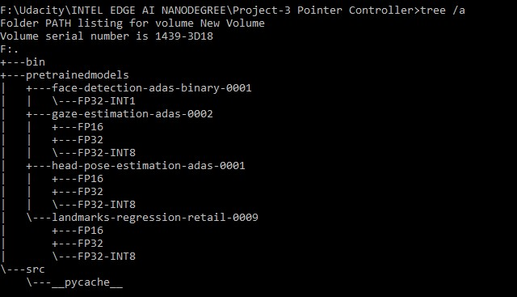

# Computer Pointer Controller
As the project name suggest, we will use a gaze detection model to control the mouse pointer of computer. We will be using the Gaze Estimation model to estimate the gaze of the user's eyes and change the mouse pointer position accordingly. This project will demonstrate to run multiple models in the same machine and coordinate the flow of data between those models.

We have used four Intel pre trained models in this application i.e. 
1)	Face Detection 
2)	Head Pose Estimation 
3)	Facial Landmarks Detection
4)	Gaze Estimation Model

We will be use the InferenceEngine API from Intel's OpenVino ToolKit to build the project. The gaze estimation model requires three inputs:
* The head pose
* The left eye image
* The right eye image.

We will have to coordinate the flow of data from the input, and then amongst the different models and finally to the mouse controller. The flow of data will look like this:


## Project Set Up and Installation
### Step 1: (Installation of OPENVINO)
Project requires OpenVINO installed in your system. See below description and install it.

Requirements based on [OpenVino toolkit](https://docs.openvinotoolkit.org/latest/_docs_install_guides_installing_openvino_windows.html).

* 6th-10th Generation Intel® Core™ processors
* Intel® Xeon® v5 family
* Intel® Xeon® v6 family
* Intel® Pentium® processor N4200/5, N3350/5, N3450/5 with Intel® HD Graphics
* Intel® Movidius™ Neural Compute Stick
* Intel® Neural Compute Stick 2
* Intel® Vision Accelerator Design with Intel® Movidius™ VPUs

### Step 2: (Dependencies)
Then we install the prerequisites from requirements.txt using the following command
```
pip install -r requirements.txt
```
### Step 3: (Initialize the OpenVINO environment)
```
cd C:\Program Files (x86)\IntelSWTools\openvino\bin\
```
```
setupvars.bat
```
### Step 4: (Download Intel Pre Trained Models)
- Download [Face Detection Model](https://docs.openvinotoolkit.org/latest/_models_intel_face_detection_adas_binary_0001_description_face_detection_adas_binary_0001.html)
```
python /opt/intel/openvino/deployment_tools/tools/model_downloader/downloader.py --name "face-detection-adas-binary-0001"
```
- Download [Facial Landmarks Detection Model](https://docs.openvinotoolkit.org/latest/_models_intel_landmarks_regression_retail_0009_description_landmarks_regression_retail_0009.html)
```
python /opt/intel/openvino/deployment_tools/tools/model_downloader/downloader.py --name "landmarks-regression-retail-0009"
```
- Download [Head Pose Estimation Model](https://docs.openvinotoolkit.org/latest/_models_intel_head_pose_estimation_adas_0001_description_head_pose_estimation_adas_0001.html)
```
python /opt/intel/openvino/deployment_tools/tools/model_downloader/downloader.py --name "head-pose-estimation-adas-0001"
```
- Download [Gaze Estimation Model](https://docs.openvinotoolkit.org/latest/_models_intel_gaze_estimation_adas_0002_description_gaze_estimation_adas_0002.html)
```
python /opt/intel/openvino/deployment_tools/tools/model_downloader/downloader.py --name "gaze-estimation-adas-0002"
```
## Structure of directory



## DEMO
In order to run the application, run following commands:
- Initialize the OpenVINO environment
```
cd C:\Program Files (x86)\IntelSWTools\openvino\bin\
```
```
setupvars.bat
```
- Go to the application directory
```
cd <Project-Path>
```
- Run main.py
```
python src/main.py -f pretrainedmodels/face-detection-adas-binary-0001/FP32-INT1/face-detection-adas-binary-0001.xml -fl pretrainedmodels/landmarks-regression-retail-0009/FP32/landmarks-regression-retail-0009.xml -hp pretrainedmodels/head-pose-estimation-adas-0001/FP32/head-pose-estimation-adas-0001.xml -g pretrainedmodels/gaze-estimation-adas-0002/FP32/gaze-estimation-adas-0002.xml -i bin/demo.mp4 ("video file" or "CAM") -d CPU (“Target Device”)
```

## Command line arguments
The following Command line arguments is fed in the main.py file:
* -f "Path to an .xml file with Face Detection model>"
* -fl "Path to an .xml file with Facial Landmark Detection model"
* -hp "Path to an .xml file with Head Pose Estimation model".
* -g "Path to an .xml file with Gaze Estimation model"
* -i "Path to image or video file or CAM"
* -d "Target device"
* -flag  (optional): Visualize different model output on frame 

## BENCHMARKS
I tested all the different performance for different model precisions
- FP16 precision
```
python src/main.py -f pretrainedmodels/face-detection-adas-binary-0001/FP32-INT1/face-detection-adas-binary-0001.xml -fl pretrainedmodels/landmarks-regression-retail-0009/FP16/landmarks-regression-retail-0009.xml -hp pretrainedmodels/head-pose-estimation-adas-0001/FP16/head-pose-estimation-adas-0001.xml -g pretrainedmodels/gaze-estimation-adas-0002/FP16/gaze-estimation-adas-0002.xml -i bin/demo.mp4 -d CPU
```

* Total loading time: 1.13 seconds
* Total Inference time : 11.9 seconds
* FPS : 1.68 frames/second


- FP32 precision
```
python src/main.py -f pretrainedmodels/face-detection-adas-binary-0001/FP32-INT1/face-detection-adas-binary-0001.xml -fl pretrainedmodels/landmarks-regression-retail-0009/FP32/landmarks-regression-retail-0009.xml -hp pretrainedmodels/head-pose-estimation-adas-0001/FP32/head-pose-estimation-adas-0001.xml -g pretrainedmodels/gaze-estimation-adas-0002/FP32/gaze-estimation-adas-0002.xml -i bin/demo.mp4 -d CPU
```

* Total models loading time: 2.98 seconds
* Total Inference time : 33.6 seconds
* FPS : 1.76 frames/second

- INT8
```
python src/main.py -f pretrainedmodels/face-detection-adas-binary-0001/FP32-INT1/face-detection-adas-binary-0001.xml -fl pretrainedmodels/landmarks-regression-retail-0009/FP32-INT8/landmarks-regression-retail-0009.xml -hp pretrainedmodels/head-pose-estimation-adas-0001/FP32-INT8/head-pose-estimation-adas-0001.xml -g pretrainedmodels/gaze-estimation-adas-0002/FP32-INT8/gaze-estimation-adas-0002.xml -i bin/demo.mp4 -d CPU
```

* Total models loading time: 3.28 seconds
* Total Inference time : 32.3 seconds
* FPS : 1.83 frames/second

## RESULTS
•	Lower precision model give lower accuracy.
•	When using lower inference models the inference becomes faster.


